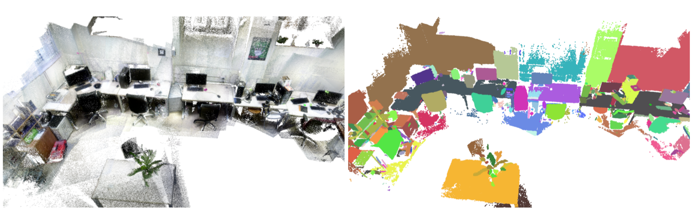
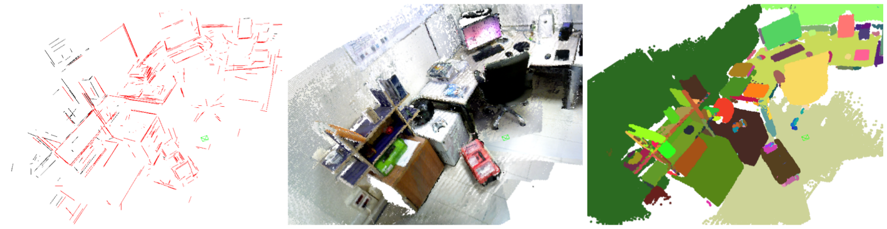

# PLVS II

Author: [Luigi Freda](https://www.luigifreda.com)

PLVS is a real-time system that leverages sparse SLAM, volumetric mapping, and 3D unsupervised incremental segmentation. PLVS stands for **Points**, **Lines**, **Volumetric mapping**, and **Segmentation**. 

 
 
 
 

PLVS is available in two different versions.
- **PLVS I**: hosted in the branch `plvs1`. It is based on [ORB-SLAM2](https://github.com/raulmur/ORB_SLAM2), and supports mono, stereo, and RGB-D cameras.
- **PLVS II**: hosted in the `master` branch. It is based on [ORB-SLAM3](https://github.com/UZ-SLAMLab/ORB_SLAM3), and also supports camera systems provided with IMUs. 

[Here](./new_features.md) you can find a list of the **new features** provided by PLVS. You can find further information and videos on this [page](https://www.luigifreda.com/research/plvs-an-open-source-rgb-d-and-stereo-slam-for-volumetric-reconstruction-and-3d-incremental-segmentation/) and in the following **document**:

**[PLVS: A SLAM System with Points, Lines, Volumetric Mapping, and 3D Incremental Segmentation](https://arxiv.org/pdf/2309.10896.pdf)**         
*Luigi Freda* 

**Note**: PLVS is an active project. This *README* is under construction and will be updated soon with further information and details. Code improvements are coming soon.

  
## Quick start 

The following procedures were tested under **Ubuntu 20**. If you don't have it, check [rosdocker](https://github.com/luigifreda/rosdocker) and use the *noetic* container.

### Build

- Install basic dependencies:      
  `$ ./install_dependencies.sh`        
- Install *OpenCV* in a local folder:                 
  `$ ./install_local_opencv.sh`      
  (if you want, skip this step and set the variable `OpenCV_DIR` in `config.sh` with your local *OpenCV* path)     
- Build the *PLVS* framework:       
  `$ ./build.sh`

Under **ROS noetic** you can run:        
`$ ./build_ros_catkin.sh`       
to build the *PLVS* ROS workspace and deploy it into the `ros_ws` folder.

It should be easy to adapt the above procedures if you have a different OS or ROS version.

### Running the examples 

Once everything is built, you can enter in the `Scripts` folder and test the different examples. For instance you can configure and run: 
- `$ ./run_tum_rgbd.sh` for TUM RGB-D datasets 
- `$ ./run_kitti_stereo.sh` for KITTI datasets
- `$ ./run_euroc_stereo_inertial.sh` for Euroc datasets, stereo + inertial
- `$ ./run_euroc_stereo.sh` for Euroc datasets, only stereo
- `$ ./run_tum_vi_stereo.sh` for TUM VI datasets, only stereo
- `$ ./run_tum_vi_stereo_inertial.sh` for TUM VI datasets, stereo + inertial

In each of the above scripts, you have to configure the `DATASET_BASE_FOLDER`, the specific `DATASET` of interest, and the used `YAML` configuration file. In particular, each configuration file shows different sections with commented options. For a quick overview of the **new features** and their corresponding yaml options refer to [new_features.md](./new_features.md).   

If you built the ROS workspace, you can use the scripts `ros_xterm*` to launch the PLVS ROS nodes. For instance, 
* with the TUM datasets, run `ros_xterm_tum_rgbd.sh`.

## Contributing

You are welcome to contribute to the code base by using pull requests, reporting bugs, leaving comments, and proposing new features through issues. Feel free to get in touch: *luigifreda(at)gmail(dot)com*. Thank you!

## License 

We release PLVS under [GPLv3 license](./LICENSE). PLVS contains some modified libraries, each one coming with its license. Where nothing is specified, a GPLv3 license applies to the software.

Please cite our work if you use PLVS in your projects.

## Credits  

* The *PLVS I* and *PLVS II* frameworks are based on [ORB-SLAM2](https://github.com/raulmur/ORB_SLAM2) and [ORB-SLAM3](https://github.com/UZ-SLAMLab/ORB_SLAM3) respectively. Many thanks to their Authors for their great work and contributions to the Research and open-source communities. 

